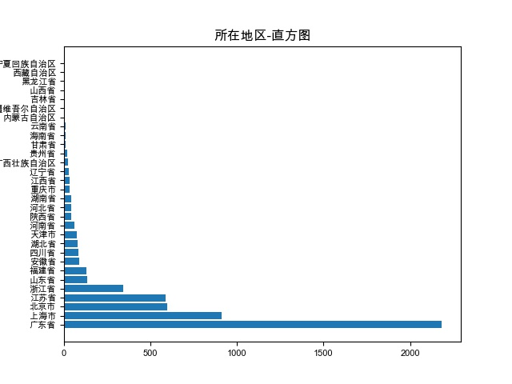

# BigData Project1 : Data Clean

# 1职务等级-直方图

# 2职务等级-饼图

# 3工作类别-直方图

# 4工作类别-饼图

# 5注册资金等级-直方图

# 6注册资金等级-饼图

# 7公司类别-直方图

# 8公司类别-饼图

# 9所在地区-直方图

# 10所在地区-饼图

# 11注册资金-公司年龄

# 12是否认证-公司是否认证

# 13认证用户与非认证用户 职务分布情况 差异-直方图

# 14认证公司和非认证公司 注册资金 差异-直方图

# 15认证公司和非认证公司 公司年龄 差异-直方图

